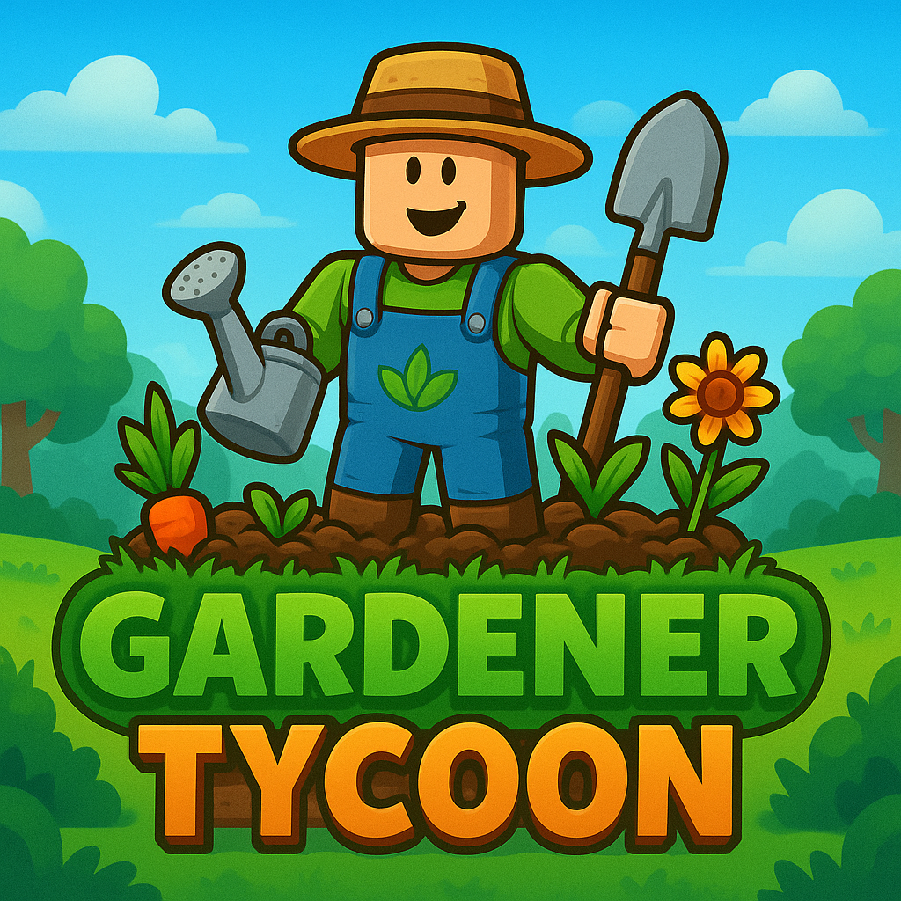

  

# Gardener Tycoon – Game Codes

---

## 🌍 English Version (EN)

### Welcome to the official **Gardener Tycoon** codes page!  
Here you can find special redeemable codes for the game.  
By using these codes, you can get **money, gems, seeds**, and many other rewards!  

👉 How to use codes:  
1. Open the game in Roblox.  
2. Look for the **Codes Menu** inside the GUI.  
3. Enter a valid code and claim your reward.  

Stay tuned – new codes appear during updates and special events!  

🎮 You can find the game >[HERE](https://www.roblox.com/share?code=54333ff9a2204d4d8f0dc01b36c5d40a&type=ExperienceDetails&stamp=1759063305969)<  

---

## 🇵🇱 Polska Wersja (PL)

### Witamy na oficjalnej stronie kodów do gry **Gardener Tycoon**!  
Tutaj znajdziesz specjalne kody, które możesz wykorzystać w grze.  
Dzięki nim zdobędziesz **pieniądze, klejnoty, nasiona** i wiele innych nagród!  

👉 Jak używać kodów:  
1. Uruchom grę w Roblox.  
2. Otwórz **menu Kodów** w GUI.  
3. Wpisz poprawny kod i odbierz nagrodę.  

Śledź tę stronę – nowe kody pojawiają się przy aktualizacjach i specjalnych wydarzeniach!  

🎮 Grę znajdziesz >[TUTAJ](https://www.roblox.com/share?code=54333ff9a2204d4d8f0dc01b36c5d40a&type=ExperienceDetails&stamp=1759063305969)<  

---
